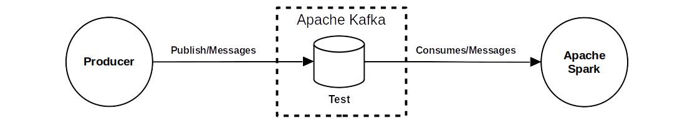

# StreamingProcessing
Streaming processing using Spark and Kafka

This is an example how to do streaming processing using Apache Spark consuming data from Apache Kafka. The figure shows the data-flow.

