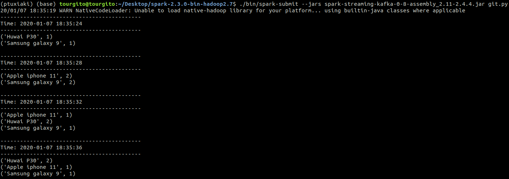

# StreamingProcessing
Streaming processing using Spark and Kafka

This is an example of streaming processing using Apache Spark consuming data from Apache Kafka. The figure 1.1 shows the data-flow.

Figure 1.1 Architecture of data-flow

On the left is a Producer, who produces messages to Kafka. In the middle is Kafka and on the right is the Spark programm.

The Producer is a Kafka producer. I use the confluent-kafka python API.

The Kafka version I use is 2.12-2.3.0.

The Spark version I use is 2.3.0-bin-hadoop2.7 and for the streaming processing I use the spark streaming API.

The python version I use is 3.6.9

# Example

Below is a example from the beginning, where the Producer published messages to the Kafka, to the moment in which the Spark programm consumes the messages and process them. The messages that the Producer published, each contains a name of a phone.

Figure 1.2 shows tha Kafka saved succesfully the messages that the Producer send. The messages that the Producer send were fifteen.

Figure 1.2 Producer produces messages to Kafka

Next, Figure 1.3 shows the messages that are saved in the topic 'Test' of Kafka, in which the Producer publishes the messages. 

Figure 1.3 Messages saved in the topic 'Test' of Kafka

Each line in Figure 1.3 is a different message. Each message is a name of a phone.

The Spark programm, which use spark streaming, uses a tumbling window of four seconds. In the messages that it groups every four seconds, it uses MapReduce to process them. For each message, it produces a key-value pair. The key is the name of the phone and the value is 1. The reduce functions adds the values of the similarly keys. Figure 1.4 shows the the results of the MapRuduce for the Spark programm. 

Figure 1.4 Spark programm execution

From the result of the MapReduce of the first grouped messages we can understand that there were two messaged. One Huwai P30 and one Samsung galaxy 9. Next, from the result of the MapReduce of the second grouped messages we can understand that there were four messaged. Two Samsung galaxy 9 and two Apple iphone 11. The same way we analyze the nexts results of the MapReduces.
